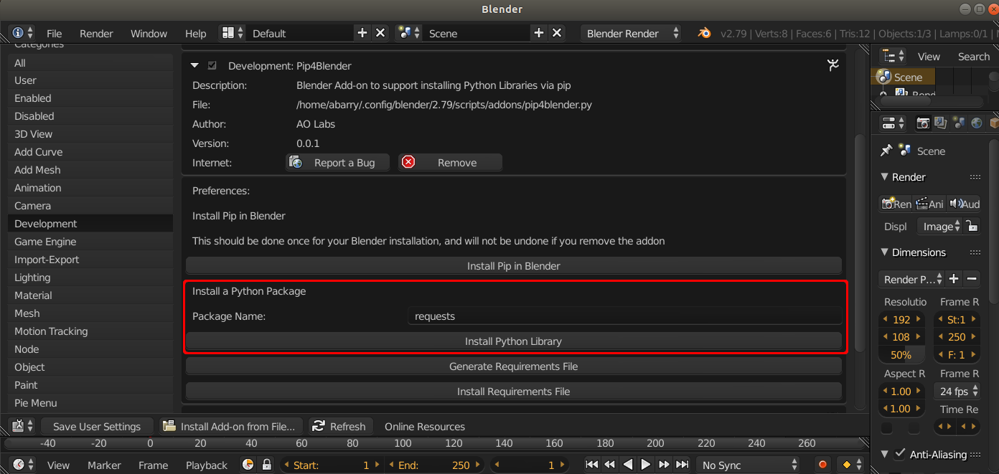

.. _addondeps:

Developing with Pip4Blender
===========================

Developers creating new Add-ons will benefit the most from pip4blender.  During
initial development, developers can install libraries as needed, one-by-one.  This
reduces the overall cost of development by promoting use of solid, well-tested,
third-party libraries instead of the same code re-written over and over again.

Upgrading a Library
-------------------

Upgrading a library can be accomplished by pre-pending '--upgrade' to the name
of the library.  For example, to upgrade the requests library, we would enter
'--upgrade requests' into the 'Package Name' text field, then hit 'Install Python Library'.

Distribution
------------

Once an add-on is complete (enough) to release to the public, a requirements.txt
file can be generated, which specifies the name and version of all dependent
packages.  This file can then be packaged along with an add-on, and distributed.

.. image:: _images/Generate_ReqFile.png

User Installation
-----------------

Users who have pip4blender installed can hit the 'Install Requirements File'
button, which will open a file browser to select the requirements file supplied
by the developer.

