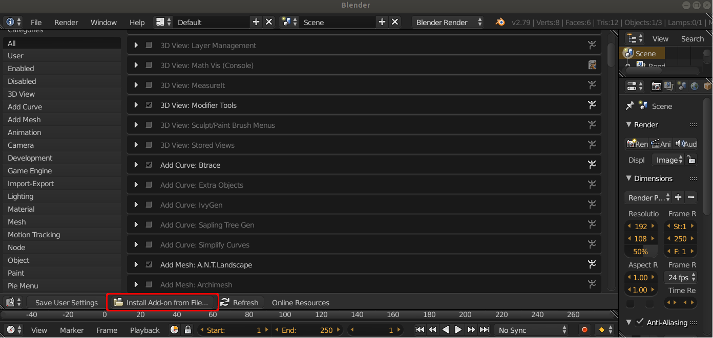

.. _install:

Installation
============

Pip4Blender is installed exactly like any other Blender add-on, and is distributed
as a single Python file.

Add-on Install
--------------

From the User Preferences panel, select 'Install Addon from File', and select the
pip4blender.py file.

Pip Install
-----------

Installing Pip in the Blender environment is also required before the rest of the
functionality of the add-on is accessed.  This can be done by selecting the
'Install Pip in Blender' button, but only needs to be done once for any given
Blender installation.

This might take a few minutes to run, if you want to watch the installation
progress you should run Blender from a terminal.

.. image:: _images/Install_Pip.png
