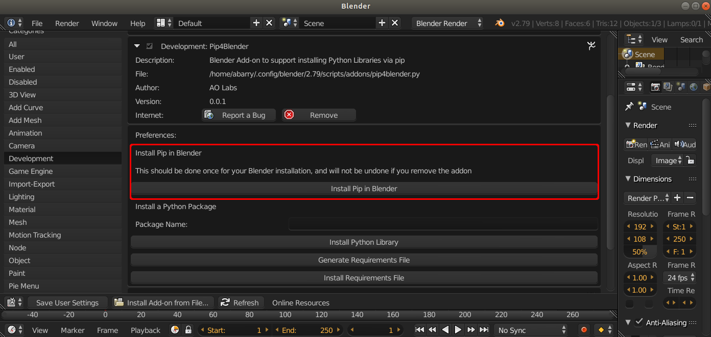

.. _install:

Installation
============

Add-on Install
--------------

Pip4Blender is installed exactly like any other Blender add-on, and is distributed
as a single Python file.

From the User Preferences panel, select 'Install Addon from File', and select the
pip4blender.py file.

.. image:: _images/Install.png

Pip Install
-----------

Installing Pip in the Blender environment is also required before the rest of the
functionality of the add-on is accessed.  This can be done by selecting the
'Install Pip in Blender' button, but only needs to be done once for any given
Blender installation.

:ref:`Continue on to Get Started using pip4blender<quickstart>`
